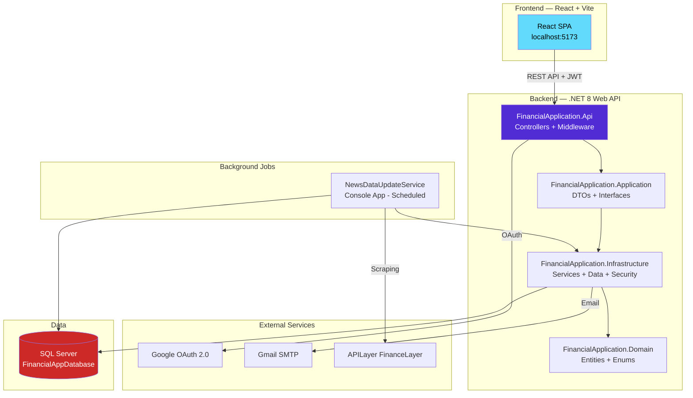
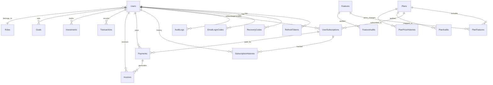
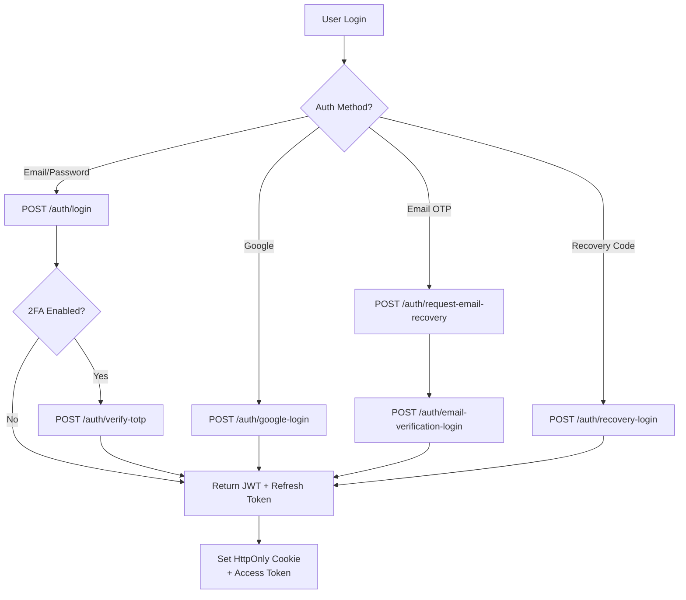
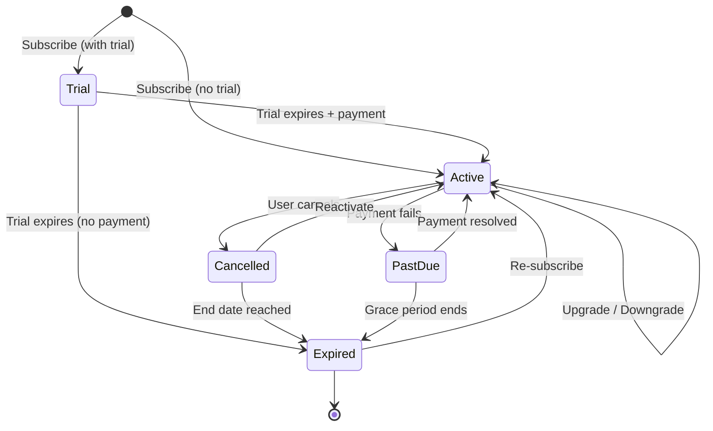
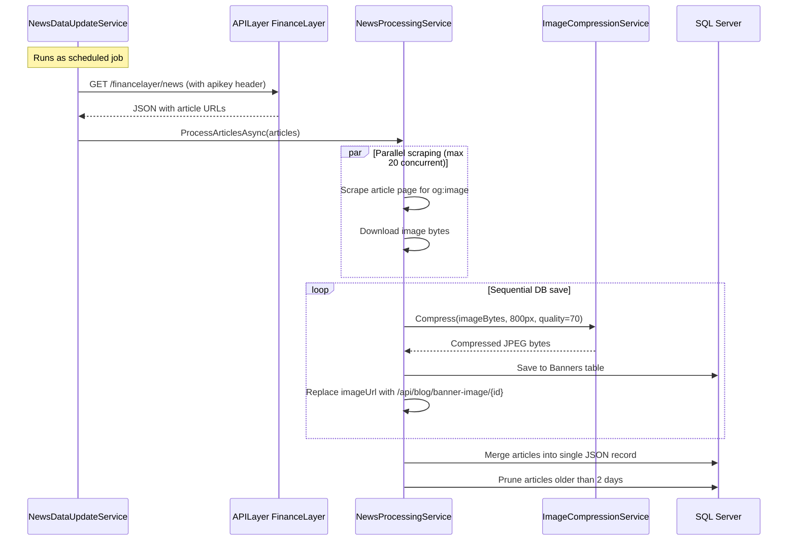

# 📚 FinancialApplication — Complete Project Documentation

> **Last Updated:** August 25, 2026  
> **Tech Stack:** .NET 8 (Backend) + React/Vite/TypeScript (Frontend) + SQL Server (Database)  
> **Architecture:** Clean Architecture (Domain → Application → Infrastructure → API)

---

## Table of Contents

1. [Project Overview](#1-project-overview)
2. [Architecture](#2-architecture)
3. [Backend — Solution Structure](#3-backend--solution-structure)
4. [Frontend — React Application](#4-frontend--react-application)
5. [Database Schema](#5-database-schema)
6. [API Endpoints Reference](#6-api-endpoints-reference)
7. [Authentication & Security](#7-authentication--security)
8. [Subscription & Billing System](#8-subscription--billing-system)
9. [News Processing Pipeline](#9-news-processing-pipeline)
10. [Image Compression System](#10-image-compression-system)
11. [Setup & Installation Guide](#11-setup--installation-guide)
12. [Configuration Reference](#12-configuration-reference)
13. [Deployment Guide](#13-deployment-guide)

---

## 1. Project Overview

**FinancialApplication** is a full-stack personal finance management platform with:

- **Multi-factor Authentication** — Email/password, Google OAuth, TOTP 2FA, email OTP, recovery codes
- **Subscription & Billing** — 4-tier plan system (Free/Basic/Advanced/Pro) with feature gating
- **Financial News** — Automated web scraping with image compression and caching
- **Admin Dashboard** — User management, role-based access, plan/feature administration
- **Transaction & Investment Tracking** — Personal finance tools gated by subscription tier

---

## 2. Architecture



### Clean Architecture Layers

| Layer | Project | Responsibility |
|-------|---------|---------------|
| **Domain** | `FinancialApplication.Domain` | Entities, Enums — zero dependencies |
| **Application** | `FinancialApplication.Application` | DTOs, Interfaces — depends only on Domain |
| **Infrastructure** | `FinancialApplication.Infrastructure` | EF Core, Services, Security — implements Application interfaces |
| **API** | `FinancialApplication.Api` | Controllers, Middleware, DI configuration |
| **Background** | `NewsDataUpdateService` | Console app for scheduled news data updates |
| **Tests** | `FinancialApplication.Tests` | Unit and integration tests |

---

## 3. Backend — Solution Structure

```
FinancialApplication/
├── FinancialApplication.slnx
│
├── FinancialApplication.Domain/
│   └── Domain/
│       ├── Entity/              # 22 entity classes
│       │   ├── User.cs
│       │   ├── Role.cs
│       │   ├── RefreshToken.cs
│       │   ├── RecoveryCode.cs
│       │   ├── EmailLoginCode.cs
│       │   ├── AuditLog.cs
│       │   ├── Transaction.cs
│       │   ├── Investment.cs
│       │   ├── Goal.cs
│       │   ├── Plan.cs
│       │   ├── Feature.cs
│       │   ├── PlanFeature.cs    # Junction table
│       │   ├── UserSubscription.cs
│       │   ├── SubscriptionHistory.cs
│       │   ├── Payment.cs
│       │   ├── Invoice.cs
│       │   ├── PlanAudit.cs
│       │   ├── PlanPriceHistory.cs
│       │   ├── FeatureAudit.cs
│       │   ├── FinanceNewsArticle.cs
│       │   ├── TodayNewsArticle.cs
│       │   └── Banner.cs        # Compressed image storage
│       └── Enums/
│           ├── BillingCycleEnum.cs     # Monthly, Annual
│           ├── SubscriptionStatusEnum.cs # Active, Trial, Cancelled, Expired...
│           ├── SubscriptionActionEnum.cs # Subscribe, Upgrade, Downgrade...
│           ├── PaymentStatusEnum.cs      # Pending, Completed, Failed, Refunded
│           ├── InvoiceStatusEnum.cs      # Draft, Issued, Paid, Void
│           ├── GoalStatusEnum.cs
│           └── TransactionTypeEnum.cs
│
├── FinancialApplication.Application/
│   ├── DTOs/                    # 22+ Data Transfer Objects
│   │   ├── RegisterDto.cs
│   │   ├── LoginUserDto.cs
│   │   ├── AuthResponseDto.cs
│   │   ├── AuthenticationResult.cs
│   │   ├── GoogleLoginDto.cs
│   │   ├── TotpVerifyDto.cs
│   │   ├── LogoutRequestDto.cs
│   │   ├── BannerRequestDto.cs
│   │   ├── BannerResponseDto.cs
│   │   └── Subscription/       # Subscription-specific DTOs
│   └── Interfaces/              # 12 service interfaces
│       ├── IAuthService.cs
│       ├── IAdminService.cs
│       ├── IAuditService.cs
│       ├── IJwttokenGenerator.cs
│       ├── ISubscriptionService.cs
│       ├── IPlanService.cs
│       ├── IFeatureService.cs
│       ├── IFeatureAccessResolver.cs
│       ├── IPaymentGateway.cs
│       ├── INewsProcessingService.cs
│       ├── IBannerFetchService.cs
│       └── IImageCompressionService.cs
│
├── FinancialApplication.Infrastructure/
│   ├── Data/
│   │   └── AppDbContext.cs      # EF Core context (751 lines, full config)
│   ├── Migrations/              # EF Core migrations
│   ├── Security/
│   │   ├── JwtTokenGenerator.cs      # JWT access + refresh token generation
│   │   ├── RefreshToken.cs            # Refresh token handler
│   │   ├── PasswordHasher.cs          # PBKDF2 password hashing
│   │   └── AuthorizationService.cs    # Role-based authorization
│   └── Services/
│       ├── AuthService.cs             # Auth logic (37K LOC, all auth flows)
│       ├── AdminService.cs            # Admin user management
│       ├── AuditService.cs            # Audit logging
│       ├── SubscriptionService.cs     # Subscription lifecycle (35K LOC)
│       ├── PlanService.cs             # Plan CRUD + feature mapping
│       ├── FeatureService.cs          # Feature management
│       ├── FeatureAccessResolver.cs   # Feature gating logic
│       ├── SimulatedPaymentGateway.cs # Mock payment processor
│       ├── NewsProcessingService.cs   # News scraping + compression pipeline
│       ├── BannerFetchService.cs      # Banner image fetching
│       └── ImageCompressionService.cs # ImageSharp-based compression
│
├── FinancialApplication.Api/
│   ├── Program.cs               # DI, middleware, JWT config
│   ├── Controllers/
│   │   ├── Auth/
│   │   │   └── AuthController.cs          # 11 auth endpoints
│   │   ├── Admin/
│   │   │   ├── AdminController.cs         # User management
│   │   │   ├── PlanAdminController.cs     # Plan CRUD (6 endpoints)
│   │   │   ├── FeatureAdminController.cs  # Feature CRUD (4 endpoints)
│   │   │   └── SubscriptionAdminController.cs # Subscription admin
│   │   ├── SubscriptionController.cs      # User subscription (9 endpoints)
│   │   ├── BlogController.cs             # Banner image endpoints
│   │   ├── FinanceNewsController.cs       # Finance news API
│   │   └── TodayNewsController.cs         # Today's news API
│   └── Services/
│       └── NewsCacheWarmupService.cs      # Cache preload on startup
│
├── NewsDataUpdateService/       # Console app for scheduled news updates
│   ├── Program.cs
│   └── appsettings.json
│
├── FinancialApplication.Tests/  # Test project
└── Documentation/               # This documentation folder
```

---

## 4. Frontend — React Application

**Location:** `D:\FinancialApllication_Frontend\Frontend\`  
**Tech Stack:** React + Vite + TypeScript  
**Dev Server:** `http://localhost:5173`

### Key Frontend Features

| Feature | Description |
|---------|-------------|
| **Authentication** | Login, Register, Google OAuth, TOTP 2FA verification |
| **Dashboard** | Financial overview with charts and widgets |
| **News Tabs** | Today's News + Financial News with image cards |
| **Subscription** | Plan selection, upgrade/downgrade, billing history |
| **Profile** | User settings, security configuration |
| **Admin Panel** | User/role/plan/feature management (admin-only) |

### API Configuration

Frontend connects to backend via `apiconfig.ts`:

```typescript
// Base URL for API calls
const API_BASE = "http://localhost:5000/api";
```

### CORS Configuration

```
Allowed Origins: http://localhost:5173, https://localhost:5173
Allowed: Any Header, Any Method, Credentials
```

---

## 5. Database Schema

**Database:** `FinancialAppDatabase`  
**Server:** `SQL Server Express (ANUBHAV\SQLEXPRESS)`

> [!IMPORTANT]
> A complete idempotent SQL create script is available at:  
> `Documentation/database_create_script.sql`

### Entity Relationship Diagram



### Complete Table Reference

#### Core Tables

| Table | Purpose | Key Columns |
|-------|---------|-------------|
| `Users` | User accounts | `Id (Guid)`, `Email`, `Username`, `PasswordHash`, `GoogleId`, `RoleId`, `TotpSecret`, `IsTwoFactorEnabled` |
| `Roles` | RBAC roles | `Id (int)`, `Name`, `IsActive` — Seeded: User, Admin, Manager, Auditor |
| `RefreshTokens` | JWT refresh tokens | `RefreshTokenId`, `UserId`, `Token`, `ExpiryDate`, `IsRevoked` |
| `RecoveryCodes` | 2FA recovery codes | `Id`, `UserId`, `CodeHash`, `IsUsed` |
| `EmailLoginCodes` | Email OTP codes | `Id`, `UserId`, `CodeHash`, `ExpiresAt` |
| `AuditLogs` | Security audit trail | `AuditLogId`, `UserId`, `Action`, `Details`, `CreatedAt` |

#### Financial Tables

| Table | Purpose | Key Columns |
|-------|---------|-------------|
| `Transactions` | Income/expense records | `Id`, `UserId`, `Amount`, `Type`, `Category`, `Description` |
| `Investments` | Investment portfolio | `Id`, `UserId`, `AssetName`, `Amount`, `CurrentValue` |
| `Goals` | Financial goals | `Id`, `UserId`, `Name`, `TargetAmount`, `CurrentAmount`, `Status` |

#### Subscription & Billing Tables

| Table | Purpose | Key Columns |
|-------|---------|-------------|
| `Plans` | Subscription tiers | `Id (Guid)`, `Name`, `Slug`, `MonthlyPrice`, `AnnualPrice`, `TrialDays` |
| `Features` | Feature flags | `Id (Guid)`, `FeatureKey`, `DisplayName`, `Category`, `IsActive` |
| `PlanFeatures` | Plan ↔ Feature mapping | `PlanId`, `FeatureId` — Composite unique |
| `UserSubscriptions` | Active subscriptions | `UserId`, `PlanId`, `Status`, `BillingCycle`, `StartDate`, `EndDate` |
| `SubscriptionHistories` | Change log | `UserId`, `SubscriptionId`, `Action`, `FromPlanId`, `ToPlanId` |
| `Payments` | Payment records | `UserId`, `SubscriptionId`, `Amount`, `Status`, `TransactionRef` |
| `Invoices` | Generated invoices | `InvoiceNumber`, `UserId`, `Amount`, `Tax`, `TotalAmount`, `Status` |
| `PlanAudits` | Plan change history | `PlanId`, `Action`, `OldValues`, `NewValues` |
| `PlanPriceHistories` | Price change tracking | `PlanId`, `OldMonthlyPrice`, `NewMonthlyPrice` |
| `FeatureAudits` | Feature change history | `FeatureId`, `Action`, `OldValues`, `NewValues` |

#### News & Media Tables

| Table | Purpose | Key Columns |
|-------|---------|-------------|
| `FinanceNewsArticles` | Stock/finance news (single-record storage) | `Id`, `JsonData (nvarchar(max))`, `ArticleCount`, `CreatedAt` |
| `TodayNewsArticles` | General news (single-record storage) | `Id`, `JsonData (nvarchar(max))`, `ArticleCount`, `CreatedAt` |
| `Banners` | Compressed news images | `Id (Guid)`, `CompressedImage (varbinary(max))`, `ContentType`, `OriginalUrl` |

### Seeded Data

#### Roles (4 seeded)
| Id | Name |
|----|------|
| 1 | User |
| 2 | Admin |
| 3 | Manager |
| 4 | Auditor |

#### Plans (4 seeded)
| Name | Monthly (₹) | Annual (₹) | Trial | Features |
|------|-------------|------------|-------|----------|
| **Free** | 0 | 0 | 0 days | 6 core features |
| **Basic** | 499 | 4,999 | 7 days | 9 features |
| **Advanced** | 999 | 9,999 | 14 days | 13 features |
| **Pro** | 1,499 | 14,999 | 14 days | All 15 features |

#### Features (15 seeded)

| Key | Name | Category | Free | Basic | Advanced | Pro |
|-----|------|----------|------|-------|----------|-----|
| `dashboard` | Dashboard | Core | ✅ | ✅ | ✅ | ✅ |
| `transactions` | Transactions | Core | ✅ | ✅ | ✅ | ✅ |
| `news` | Financial News | Core | ✅ | ✅ | ✅ | ✅ |
| `profile` | Profile Management | Core | ✅ | ✅ | ✅ | ✅ |
| `security_settings` | Security Settings | Core | ✅ | ✅ | ✅ | ✅ |
| `onboarding` | Onboarding | Core | ✅ | ✅ | ✅ | ✅ |
| `analytics` | Analytics | Analytics | ❌ | ✅ | ✅ | ✅ |
| `investment_tracking` | Investment Tracking | Investments | ❌ | ✅ | ✅ | ✅ |
| `cards` | Cards Management | Finance | ❌ | ✅ | ✅ | ✅ |
| `reports` | Reports | Reports | ❌ | ❌ | ✅ | ✅ |
| `export_pdf` | Export PDF | Reports | ❌ | ❌ | ✅ | ✅ |
| `export_csv` | Export CSV | Reports | ❌ | ❌ | ✅ | ✅ |
| `premium_analytics` | Premium Analytics | Analytics | ❌ | ❌ | ✅ | ✅ |
| `ai_suggestions` | AI Suggestions | AI | ❌ | ❌ | ❌ | ✅ |
| `user_management` | User Management | Admin | ❌ | ❌ | ❌ | ✅ |

---

## 6. API Endpoints Reference

**Base URL:** `http://localhost:5000/api`  
**Auth:** JWT Bearer token (unless marked as public)

### Authentication (`/api/auth`)

| Method | Endpoint | Auth | Description |
|--------|----------|------|-------------|
| `POST` | `/auth/register` | Public | Register new user account |
| `POST` | `/auth/login` | Public | Login with email/password |
| `POST` | `/auth/verify-totp` | Public | Verify TOTP 2FA code |
| `POST` | `/auth/recovery-login` | Public | Login with recovery code |
| `POST` | `/auth/request-email-recovery` | Public | Request email OTP for login |
| `POST` | `/auth/email-verification-login` | Public | Login with email OTP |
| `POST` | `/auth/verify-signup-email-otp` | Public | Verify email during signup |
| `POST` | `/auth/google-login` | Public | Login/register via Google OAuth |
| `POST` | `/auth/logout` | 🔒 JWT | Logout (revoke tokens) |
| `GET` | `/auth/checkauth` | 🔒 JWT | Validate current session |
| `POST` | `/auth/verify-recovery-code-for-qr` | 🔒 JWT | Verify recovery code to show QR |

### Subscription (`/api/subscription`)

| Method | Endpoint | Auth | Description |
|--------|----------|------|-------------|
| `GET` | `/subscription/current` | 🔒 JWT | Get current subscription details |
| `GET` | `/subscription/my-features` | 🔒 JWT | Get user's accessible features |
| `GET` | `/subscription/plans` | 🔒 JWT | List all available plans |
| `POST` | `/subscription/subscribe` | 🔒 JWT | Subscribe to a plan |
| `POST` | `/subscription/upgrade` | 🔒 JWT | Upgrade to higher plan |
| `POST` | `/subscription/downgrade` | 🔒 JWT | Downgrade to lower plan |
| `POST` | `/subscription/cancel` | 🔒 JWT | Cancel subscription |
| `POST` | `/subscription/reactivate` | 🔒 JWT | Reactivate cancelled subscription |
| `GET` | `/subscription/history` | 🔒 JWT | Get last 2 subscription changes |

### News (`/api/financenews` & `/api/todaynews`)

| Method | Endpoint | Auth | Description |
|--------|----------|------|-------------|
| `GET` | `/financenews` | Public | Get finance/stock news articles |
| `GET` | `/todaynews` | Public | Get general today's news |
| `GET` | `/blog/banner-image/{id}` | Public | Serve compressed image (24hr cache) |
| `POST` | `/blog/fetch-banners` | 🔒 JWT | Manually trigger banner scraping |

**News Query Parameters:**

```
?page=1&pageSize=10&search=bitcoin
```

### Admin (`/api/admin`) — Requires Admin/Manager Role

| Method | Endpoint | Policy | Description |
|--------|----------|--------|-------------|
| `POST` | `/admin/assign-role` | AdminOnly | Assign role to user |
| `POST` | `/admin/revoke-role` | AdminOnly | Revoke role from user |
| `POST` | `/admin/deactivate-user` | AdminOnly | Deactivate user account |
| `POST` | `/admin/activate-user` | AdminOnly | Reactivate user account |

### Plan Admin (`/api/planadmin`)

| Method | Endpoint | Description |
|--------|----------|-------------|
| `GET` | `/planadmin/{id}` | Get plan details |
| `PUT` | `/planadmin/{id}` | Update plan |
| `DELETE` | `/planadmin/{id}` | Delete plan |
| `POST` | `/planadmin/{id}/features` | Add feature to plan |
| `DELETE` | `/planadmin/{planId}/features/{featureId}` | Remove feature from plan |
| `PUT` | `/planadmin/{id}/pricing` | Update plan pricing |

### Feature Admin (`/api/featureadmin`)

| Method | Endpoint | Description |
|--------|----------|-------------|
| `GET` | `/featureadmin/{id}` | Get feature details |
| `PUT` | `/featureadmin/{id}` | Update feature |
| `DELETE` | `/featureadmin/{id}` | Delete feature |
| `PATCH` | `/featureadmin/{id}/toggle` | Toggle feature active/inactive |

### Subscription Admin (`/api/subscriptionadmin`)

| Method | Endpoint | Description |
|--------|----------|-------------|
| `GET` | `/subscriptionadmin/stats` | Get subscription statistics |
| `PATCH` | `/subscriptionadmin/{id}/status` | Change subscription status |

---

## 7. Authentication & Security

### Authentication Flows



### JWT Configuration

| Parameter | Value |
|-----------|-------|
| Signing Algorithm | HMAC-SHA256 |
| Key Size | ≥ 256 bits (32 chars) |
| Access Token Lifetime | 60 minutes |
| Refresh Token Lifetime | 7 days |
| Issuer | `YourApp` |
| Audience | `YourAppUsers` |
| Clock Skew | Zero |

### Security Features

- **PBKDF2** password hashing with per-user salt
- **TOTP 2FA** with QR code generation
- **Recovery codes** (one-time use, hashed)
- **Email OTP** for passwordless login
- **Refresh token rotation** with revocation
- **HttpOnly secure cookies** for token storage
- **CORS** restricted to frontend origin
- **Audit logging** for security events
- **Role-based authorization** (User, Admin, Manager, Auditor)

### Authorization Policies

| Policy | Required Roles |
|--------|---------------|
| `AdminOnly` | Admin |
| `ViewAllUsers` | Admin, Manager |
| `CreateUsers` | Admin, Manager |
| `ViewAuditLogs` | Admin, Manager, Auditor |
| `ManageRoles` | Admin |
| `EditUserData` | Admin, Manager |
| `ManageTransactions` | Admin, Manager |
| `ManageInvestments` | Admin, Manager |
| `ManageGoals` | Admin, Manager |

---

## 8. Subscription & Billing System

### Subscription Lifecycle



### Billing Cycles

- **Monthly** — Charged `MonthlyPrice` each month
- **Annual** — Charged `AnnualPrice` per year (discounted)

### Payment Gateway

Currently uses `SimulatedPaymentGateway` for development. Implements `IPaymentGateway` interface — swap with Razorpay/Stripe in production.

---

## 9. News Processing Pipeline

### Data Flow



### Storage Strategy

- **Single-record pattern**: Each news feed stores ALL articles in one DB row as a JSON array
- **Image compression**: External images → download → resize (max 800px) → JPEG quality 70 → `varbinary(max)` in `Banners` table
- **Deduplication**: By article URL (for articles) and by OriginalUrl (for images)
- **Retention**: Articles older than 2 days are automatically pruned during merge
- **Caching**: In-memory cache warmed on API startup with 30-minute TTL

### Configuration

```json
{
  "NewsService": {
    "ApiUrl": "https://api.apilayer.com/financelayer/news?...",
    "ApiKey": "<your-api-key>",
    "MaxConcurrentScrapes": 20,
    "RetentionDays": 7
  }
}
```

---

## 10. Image Compression System

### Technology

- **Library:** SixLabors.ImageSharp v3.1.7 (Apache 2.0 — free for all use)
- **Pure managed .NET** — no native dependencies

### Compression Parameters

| Parameter | Value | Purpose |
|-----------|-------|---------|
| Max Width | 800px | Resize (height auto-calculated) |
| Quality | 70 | JPEG quality level |
| Format | JPEG | Output format |
| Upscale | No | Images smaller than 800px kept as-is |

### Typical Compression Ratios

| Input | Output | Ratio |
|-------|--------|-------|
| 2MB PNG | ~80KB JPEG | ~96% reduction |
| 500KB JPEG | ~60KB JPEG | ~88% reduction |

### API Endpoint

```
GET /api/blog/banner-image/{guid}
```

Returns raw JPEG bytes with `Content-Type: image/jpeg` and 24-hour response cache.

---

## 11. Setup & Installation Guide

### Prerequisites

| Tool | Version | Purpose |
|------|---------|---------|
| .NET SDK | 8.0+ | Backend runtime |
| Node.js | 18+ | Frontend build |
| SQL Server Express | 2019+ | Database |
| Visual Studio 2022 or VS Code | Latest | IDE |

### Backend Setup

```bash
# 1. Clone the repository
git clone <repo-url>
cd FinancialApplication

# 2. Restore NuGet packages
dotnet restore

# 3. Update connection string in appsettings.json
# File: FinancialApplication.Api/appsettings.json
# Change Server=ANUBHAV\SQLEXPRESS to your SQL Server instance

# 4. Apply database migrations
dotnet ef database update --project FinancialApplication.Infrastructure --startup-project FinancialApplication.Api

# 5. Run the API
dotnet run --project FinancialApplication.Api
# API starts at: http://localhost:5000
# Swagger UI: http://localhost:5000/swagger
```

### Frontend Setup

```bash
# 1. Navigate to frontend directory
cd D:\FinancialApllication_Frontend\Frontend

# 2. Install dependencies
npm install

# 3. Start dev server
npm run dev
# Frontend starts at: http://localhost:5173
```

### News Data Update (Background Job)

```bash
# Run from the NewsDataUpdateService project directory
cd NewsDataUpdateService
dotnet run
```

> [!TIP]
> Schedule this as a Windows Task Scheduler job to run every 6 hours.

---

## 12. Configuration Reference

### Backend — `FinancialApplication.Api/appsettings.json`

```json
{
  "ConnectionStrings": {
    "DefaultConnection": "Server=YOUR_SERVER;Database=FinancialAppDatabase;Trusted_Connection=True;TrustServerCertificate=True;"
  },
  "Jwt": {
    "Key": "<min-32-character-secret-key>",
    "Issuer": "YourApp",
    "Audience": "YourAppUsers",
    "ExpireMinutes": 60,
    "RefreshTokenExpireDays": 7
  },
  "Google": {
    "ClientId": "<google-oauth-client-id>"
  },
  "Smtp": {
    "Host": "smtp.gmail.com",
    "Port": 587,
    "EnableSsl": true,
    "Username": "<email>",
    "Password": "<app-password>",
    "From": "<email>"
  }
}
```

### NewsDataUpdateService — `appsettings.json`

```json
{
  "ConnectionStrings": {
    "DefaultConnection": "Server=YOUR_SERVER;Database=FinancialAppDatabase;..."
  },
  "NewsService": {
    "ApiUrl": "https://api.apilayer.com/financelayer/news?date=today&keywords=stocks&sort=desc",
    "ApiKey": "<apilayer-api-key>",
    "RunIntervalHours": 6,
    "RetentionDays": 7,
    "MaxConcurrentScrapes": 20
  },
  "NewsConfigApi2": {
    "ApiUrl": "https://api.apilayer.com/financelayer/news?date=today&fallback=off&sort=desc",
    "ApiKey": "<apilayer-api-key>"
  }
}
```

---

## 13. Deployment Guide

### Production Checklist

> [!CAUTION]
> Before deploying to production, ensure these security steps:

- [ ] Change JWT secret key to a strong, unique 256-bit key
- [ ] Remove Google Client ID from source — use environment variables
- [ ] Remove SMTP credentials from source — use Azure Key Vault / AWS Secrets Manager
- [ ] Remove APILayer key from source — use environment variables
- [ ] Set `ASPNETCORE_ENVIRONMENT=Production`
- [ ] Enable HTTPS redirect
- [ ] Update CORS origins to production domain
- [ ] Replace `SimulatedPaymentGateway` with real payment provider
- [ ] Set up proper logging (Serilog → Application Insights / ELK)
- [ ] Schedule `NewsDataUpdateService` via Task Scheduler / Azure Functions
- [ ] Set up database backups

### Database Deployment

```bash
# Generate idempotent SQL script for DBA review
dotnet ef migrations script --idempotent \
  --project FinancialApplication.Infrastructure \
  --startup-project FinancialApplication.Api \
  --output database_create_script.sql

# Or apply directly
dotnet ef database update \
  --project FinancialApplication.Infrastructure \
  --startup-project FinancialApplication.Api
```

### NuGet Packages Used

| Package | Version | Project | Purpose |
|---------|---------|---------|---------|
| Microsoft.EntityFrameworkCore.SqlServer | 8.0.0 | Infrastructure | SQL Server ORM |
| Microsoft.EntityFrameworkCore.Tools | 8.0.0 | Infrastructure | EF migrations |
| SixLabors.ImageSharp | 3.1.7 | Infrastructure | Image compression |
| HtmlAgilityPack | — | Infrastructure | HTML scraping |
| Microsoft.AspNetCore.Authentication.JwtBearer | 8.0.0 | Api | JWT authentication |
| Microsoft.Extensions.Hosting | 8.0.0 | NewsDataUpdateService | Console host |
| Swashbuckle.AspNetCore | — | Api | Swagger/OpenAPI |

---

> **📄 Additional Documentation Files:**
> - `Documentation/database_create_script.sql` — Complete idempotent DB creation script
> - `Documentation/BACKEND_ARCHITECTURE.md` — Detailed architecture overview
> - `Documentation/VISUAL_OVERVIEW.md` — Visual system diagrams
> - `Documentation/PROJECT_DESCRIPTION.md` — Original project description
