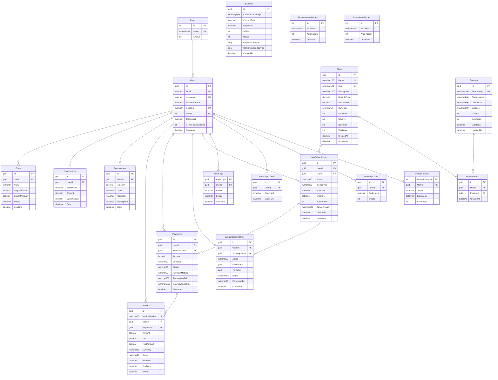

# 🗄️ Database Documentation

> **Database:** FinancialAppDatabase  
> **Engine:** SQL Server Express  
> **ORM:** Entity Framework Core 8.0 (Code-First)

---

## Quick Start — Create Database from Scratch

### Option 1: EF Core Migrations (Recommended)

```bash
# Navigate to the solution root
cd C:\Users\samar\source\repos\FinancialApplication

# Apply all migrations to create/update the database
dotnet ef database update --project FinancialApplication.Infrastructure --startup-project FinancialApplication.Api
```

### Option 2: SQL Script

Run the idempotent SQL script directly against your SQL Server:

```bash
sqlcmd -S "YOUR_SERVER\SQLEXPRESS" -i "Documentation\database_create_script.sql" -E
```

Or open `Documentation/database_create_script.sql` in SQL Server Management Studio (SSMS) and execute.

> [!NOTE]
> The script is **idempotent** — it can be run multiple times safely. It checks for existing migrations before applying changes.

---

## Connection String

```
Server=ANUBHAV\SQLEXPRESS;Database=FinancialAppDatabase;Trusted_Connection=True;TrustServerCertificate=True;
```

**Configuration files that use this connection string:**
1. `FinancialApplication.Api/appsettings.json`
2. `NewsDataUpdateService/appsettings.json`

---

## Database Diagram



---

## Migration History

To list all migrations:

```bash
dotnet ef migrations list --project FinancialApplication.Infrastructure --startup-project FinancialApplication.Api
```

### Creating a New Migration

```bash
dotnet ef migrations add YourMigrationName --project FinancialApplication.Infrastructure --startup-project FinancialApplication.Api
```

### Rolling Back

```bash
# Rollback to a specific migration
dotnet ef database update PreviousMigrationName --project FinancialApplication.Infrastructure --startup-project FinancialApplication.Api

# Remove the last migration (if not applied)
dotnet ef migrations remove --project FinancialApplication.Infrastructure --startup-project FinancialApplication.Api
```

---

## Key Indexes

| Table | Index | Type | Purpose |
|-------|-------|------|---------|
| Users | Email | Unique | Login lookup |
| Users | Username | Unique | Display name uniqueness |
| Users | GoogleId | Unique (filtered) | OAuth dedup |
| Roles | Name | Unique | Role lookup |
| Plans | Name | Unique | Plan name uniqueness |
| Plans | Slug | Unique | URL-friendly identifier |
| Plans | IsActive, SortOrder | Non-unique | Active plan listing |
| Features | FeatureKey | Unique | Feature gate lookup |
| Features | Category, IsActive | Non-unique | Category filtering |
| PlanFeatures | PlanId + FeatureId | Unique (composite) | Prevent duplicates |
| UserSubscriptions | UserId | Unique (filtered) | One active sub per user |
| UserSubscriptions | Status, EndDate, PlanId | Non-unique | Query performance |
| Payments | UserId, Status, CreatedAt | Non-unique | Payment history |
| Invoices | InvoiceNumber | Unique | Invoice lookup |
| FinanceNewsArticles | CreatedAt | Non-unique | Latest record lookup |
| TodayNewsArticles | CreatedAt | Non-unique | Latest record lookup |

---

## Useful Queries

### Check current data counts

```sql
SELECT 'Users' AS [Table], COUNT(*) AS [Count] FROM Users
UNION ALL SELECT 'Plans', COUNT(*) FROM Plans
UNION ALL SELECT 'Features', COUNT(*) FROM Features
UNION ALL SELECT 'PlanFeatures', COUNT(*) FROM PlanFeatures
UNION ALL SELECT 'UserSubscriptions', COUNT(*) FROM UserSubscriptions
UNION ALL SELECT 'Payments', COUNT(*) FROM Payments
UNION ALL SELECT 'Invoices', COUNT(*) FROM Invoices
UNION ALL SELECT 'FinanceNewsArticles', COUNT(*) FROM FinanceNewsArticles
UNION ALL SELECT 'TodayNewsArticles', COUNT(*) FROM TodayNewsArticles
UNION ALL SELECT 'Banners', COUNT(*) FROM Banners
UNION ALL SELECT 'AuditLogs', COUNT(*) FROM AuditLogs
ORDER BY [Table];
```

### Check subscription status for a user

```sql
SELECT u.Email, p.Name AS PlanName, us.Status, us.BillingCycle,
       us.StartDate, us.EndDate, us.AutoRenew
FROM UserSubscriptions us
JOIN Users u ON us.UserId = u.Id
JOIN Plans p ON us.PlanId = p.Id
WHERE us.Status IN ('Active', 'Trial');
```

### Check news article freshness

```sql
SELECT 'FinanceNews' AS Feed, ArticleCount, CreatedAt
FROM FinanceNewsArticles
UNION ALL
SELECT 'TodayNews', ArticleCount, CreatedAt
FROM TodayNewsArticles
ORDER BY CreatedAt DESC;
```

### Check banner storage usage

```sql
SELECT COUNT(*) AS TotalBanners,
       SUM(CAST(CompressedSizeBytes AS BIGINT)) / 1048576 AS TotalMB,
       AVG(CompressedSizeBytes) / 1024 AS AvgKB,
       MIN(CreatedAt) AS OldestBanner,
       MAX(CreatedAt) AS NewestBanner
FROM Banners;
```
