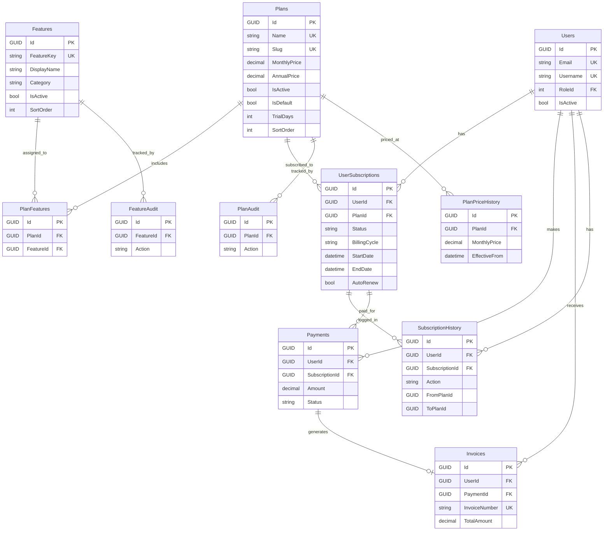
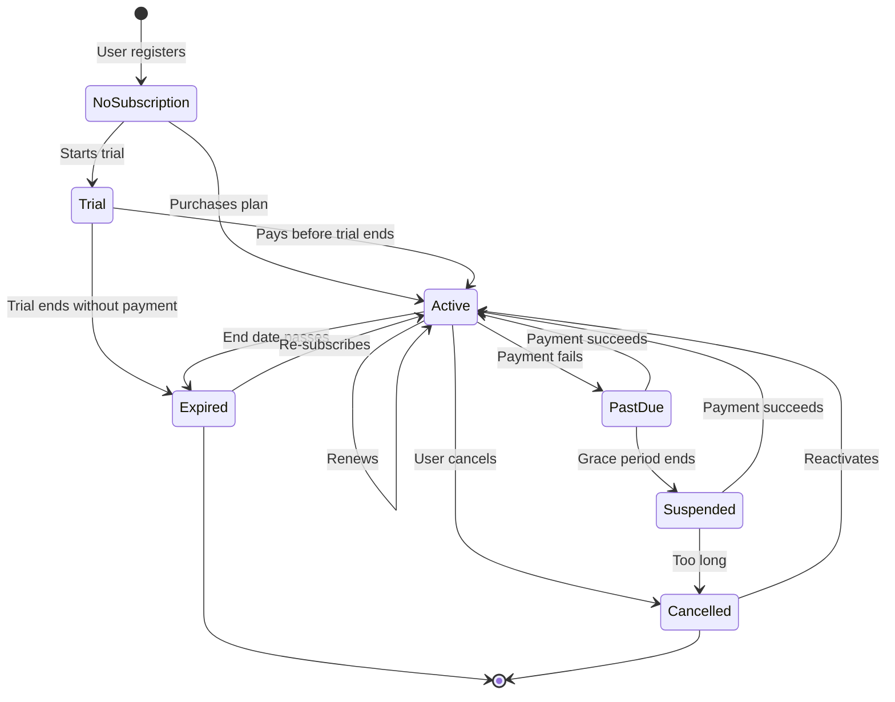

# Subscription Management System — Architecture & Design Document

## Table of Contents
1. [Current Backend Architecture Analysis](#1-current-backend-architecture-analysis)
2. [Current Frontend Architecture Analysis](#2-current-frontend-architecture-analysis)
3. [Gaps in Current Implementation](#3-gaps-in-current-implementation)
4. [Recommended Subscription Architecture](#4-recommended-subscription-architecture)
5. [Database Schema](#5-database-schema)
6. [ER Diagram](#6-er-diagram)
7. [Entity Descriptions](#7-entity-descriptions)
8. [Request/Response Flow](#8-requestresponse-flow)
9. [Authentication & Authorization Flow](#9-authentication--authorization-flow)
10. [Feature Resolution Strategy](#10-feature-resolution-strategy)
11. [Admin Management Workflow](#11-admin-management-workflow)
12. [User Subscription Lifecycle](#12-user-subscription-lifecycle)
13. [Upgrade/Downgrade Workflow](#13-upgradedowngrade-workflow)
14. [API Design](#14-api-design)
15. [React Integration Strategy](#15-react-integration-strategy)
16. [Security Considerations](#16-security-considerations)
17. [Performance Optimizations](#17-performance-optimizations)
18. [Migration Strategy](#18-migration-strategy)
19. [Risks & Edge Cases](#19-risks--edge-cases)
20. [Phased Implementation Plan](#20-phased-implementation-plan)
21. [Integration Review Against Existing Codebase](#21-integration-review-against-existing-codebase)

---

## 1. Current Backend Architecture Analysis

### Solution Structure (Clean Architecture)

```
FinancialApplication/
├── FinancialApplication.Api/           ← Presentation layer (Controllers, Program.cs)
├── FinancialApplication.Application/   ← Application layer (Interfaces, DTOs)
├── FinancialApplication.Domain/        ← Domain layer (Entities, Enums)
├── FinancialApplication.Infrastructure/← Infrastructure layer (Services, Data, Security)
├── FinancialApplication.Tests/         ← Test project
└── NewsDataUpdateService/              ← Background service
```

### Technology Stack
| Layer | Technology |
|-------|-----------|
| Runtime | .NET 8 |
| ORM | Entity Framework Core 8.0 (SQL Server) |
| Auth | JWT Bearer tokens (access + refresh) |
| 2FA | TOTP via Otp.NET + QRCoder |
| Database | SQL Server (local SQLEXPRESS) |
| Email | SMTP (Gmail) |

### Domain Entities (11 total)
| Entity | PK Type | Purpose |
|--------|---------|---------|
| `User` | `Guid` | Core user with RoleId FK, TOTP, Google auth |
| `Role` | `int` (identity) | RBAC roles (User, Admin, Manager, Auditor) |
| `Transaction` | `Guid` | Income/expense records |
| `Investment` | `Guid` | Investment portfolio |
| `Goal` | `Guid` | Financial goals |
| `RefreshToken` | `Guid` | JWT refresh tokens |
| `RecoveryCode` | `Guid` | One-time recovery codes |
| `EmailLoginCode` | `Guid` | Email verification OTPs |
| `AuditLog` | `Guid` | System audit trail |
| `FinanceNewsArticle` | `int` | Scraped finance news |
| `TodayNewsArticle` | `int` | Scraped today's news |

### Services Layer
| Service | Interface | Responsibility |
|---------|-----------|----------------|
| `AuthService` | `IAuthService` | Register, Login (2-step), TOTP, Google, Recovery, Email OTP |
| `AdminService` | `IAdminService` | Role assignment/revocation, user activate/deactivate |
| `AuditService` | `IAuditService` | Audit logging |
| `BannerFetchService` | `IBannerFetchService` | Banner image scraping |
| `NewsProcessingService` | `INewsProcessingService` | News aggregation |

### Security Layer
| Component | Pattern |
|-----------|---------|
| `JwtTokenGenerator` | Generates access/refresh tokens with role + permission claims |
| `AuthorizationService` | Claims-based authorization (reads from HttpContext) |
| `PasswordHasher` | Secure password hashing |
| `RefreshTokenGenerator` | Refresh token management |

### Authorization Model (Current)
- **Role-based**: 4 static roles (User, Admin, Manager, Auditor)
- **Policy-based**: 9 hardcoded policies in `Program.cs` (AdminOnly, ViewAllUsers, etc.)
- **Permission claims**: Hardcoded in `JwtTokenGenerator.AddPermissionClaims()` — switch/case by role
- **No database-driven permissions** — all baked into code

### Controllers
| Controller | Auth | Endpoints |
|-----------|------|-----------|
| `AuthController` | Mixed | register, login, verify-totp, google-login, recovery-login, email-recovery, logout, checkauth |
| `AdminController` | `[Authorize(Policy="AdminOnly")]` | assign-role, revoke-role, deactivate-user, activate-user |
| `FinanceNewsController` | None visible | News CRUD |
| `TodayNewsController` | None visible | News CRUD |
| `BlogController` | None visible | Blog endpoints |

---

## 2. Current Frontend Architecture Analysis

### Technology Stack
| Aspect | Technology |
|--------|-----------|
| Framework | React 18 + TypeScript |
| Build | Vite |
| Styling | TailwindCSS |
| Routing | React Router v6 |
| State | React Context (AuthContext) |
| HTTP | Native `fetch` API |
| Toasts | react-hot-toast |

### Folder Structure
```
Frontend/src/
├── App.tsx                     ← Route definitions
├── MainLayout.tsx              ← Sidebar + Header + Outlet
├── ProtectedLayout.tsx         ← Auth guard (checks isAuthenticated only)
├── context/AuthContext.tsx      ← Auth state, login/logout, token management
├── config/apiconfig.ts          ← API base URL + news configs
├── Component/
│   ├── partials/
│   │   ├── Sidebar.jsx          ← Main navigation (50KB — very large)
│   │   ├── Header.jsx           ← Top header bar
│   │   └── Banner.jsx           ← Banner component
│   ├── dashboard/               ← Dashboard chart components
│   └── ...
├── pages/
│   ├── Auth/                    ← Login, Signup
│   ├── Dashboard/               ← Main dashboard, analytics, reports
│   ├── News/                    ← News page
│   ├── finance/                 ← Profile, Cards, Transactions
│   ├── manageaccounts/          ← User management, Security, Investment
│   ├── settings/                ← Plans, Billing, Reset password, Notifications
│   └── Onboarding/             ← User onboarding
```

### Auth State (AuthContext)
```typescript
interface AuthState {
  user: string | null;      // email
  role: string | null;      // "Admin" | "User" | "Manager" | "Auditor"
  userId: string | null;    // GUID
  isAuthenticated: boolean;
  loading: boolean;
}
```

### Route Protection
- `ProtectedRoute` → **Only checks `isAuthenticated`**, no role/permission gating
- `Dashboard.tsx` → Has inline role checks: `authState.role === "Admin" || authState.role === "User"`
- **No feature-based route protection exists**
- **No subscription-based gating exists**

### Existing Pages That Will Need Feature Gating
| Page Route | Feature Category |
|------------|-----------------|
| `/dashboard` | Dashboard |
| `/news` | News |
| `/analytics` | Analytics |
| `/transactions` | Expense Tracking |
| `/investment-monitoring` | Investment Tracking |
| `/reports-analytics` | Reports |
| `/report-generation` | Export/Reports |
| `/plans` | Plans (placeholder) |
| `/billing` | Billing (placeholder) |
| `/profile` | Profile |
| `/cards` | Cards |
| `/onboarding` | Onboarding |
| `/security` | Security Settings |
| `/user-management` | Admin: User Management |

---

## 3. Gaps in Current Implementation

### Critical Gaps

| # | Gap | Impact |
|---|-----|--------|
| 1 | **No subscription/plan system** | Cannot monetize; all users have equal access |
| 2 | **No feature management** | Features are hardcoded; no way to dynamically toggle |
| 3 | **Permissions hardcoded in JWT generator** | Changing permissions requires code change + redeployment |
| 4 | **No repository pattern** | Services directly use `AppDbContext` — no abstraction |
| 5 | **No caching layer** | Every request hits the database |
| 6 | **No middleware for subscription/feature checks** | Can't intercept unauthorized feature access |
| 7 | **ProtectedRoute has no granularity** | Only checks `isAuthenticated`, no role/feature/plan checks |
| 8 | **No dedicated SubscriptionContext** on frontend | No way to know what features the logged-in user can access |
| 9 | **`plans.tsx` and `billing.tsx` are placeholders** | Just empty page shells |
| 10 | **`AdminController` is minimal** | Only 4 endpoints; no plan/feature management |
| 11 | **No global error handling middleware** | Exception handling scattered in controllers |
| 12 | **`RevokeRoleAsync` sets `RoleId = 0`** | Bug — should set to default User role (1), not 0 |

### Minor Gaps
- No structured logging (just `Console.WriteLine`)
- No input validation middleware (FluentValidation)
- Missing `IPasswordHasher` interface definition in Application layer (defined inline in Security folder)
- `AuthorizationService` interface defined inside the implementation file, not in Application/Interfaces

---

## 4. Recommended Subscription Architecture

### Approach: **Fully Database-Driven Feature Access Control**

> [!IMPORTANT]
> This is the correct approach for your requirements. All feature-to-plan mappings live in the database, not code. Admin changes are immediate. No redeployment needed.

### Architecture Layers

```
┌──────────────────────────────────────────────────┐
│                   React Frontend                  │
│  SubscriptionContext → useFeature("export_pdf")  │
│  FeatureGate component → hides/shows UI          │
│  ProtectedFeatureRoute → blocks routes           │
├──────────────────────────────────────────────────┤
│                   API Layer                       │
│  [RequireFeature("export_pdf")] attribute        │
│  FeatureAuthorizationMiddleware                  │
├──────────────────────────────────────────────────┤
│                Service Layer                      │
│  ISubscriptionService, IPlanService              │
│  IFeatureService, IFeatureAccessResolver         │
├──────────────────────────────────────────────────┤
│              Feature Resolution Engine            │
│  User → Active Subscription → Plan → Features   │
│  In-memory cache (IMemoryCache)                  │
│  Cache invalidation on admin changes             │
├──────────────────────────────────────────────────┤
│                  Database                         │
│  Plans, Features, PlanFeatures, UserSubscriptions│
│  SubscriptionHistory, Payments, Invoices         │
└──────────────────────────────────────────────────┘
```

### Key Design Decisions

| Decision | Choice | Rationale |
|----------|--------|-----------|
| Feature storage | Database table with `FeatureKey` (e.g., `"export_pdf"`) | Machine-readable, stable identifier for code references |
| Plan-feature mapping | `PlanFeatures` junction table | Many-to-many; admin can freely reassign |
| Permission check | Backend middleware + service | Never trust frontend alone |
| Caching | `IMemoryCache` (Phase 1), Redis (Phase 3) | Avoid DB hit on every request; in-memory is simplest to start |
| JWT claims | Include `PlanId` + `SubscriptionStatus` | Lightweight; features resolved server-side, not embedded in JWT |
| Frontend access | `/api/subscription/my-features` API endpoint | Returns allowed feature keys; cached in React context |

---

## 5. Database Schema

### New Tables (10 tables)

> [!NOTE]
> All new tables use `Guid` primary keys to match existing conventions. `CreatedAt`/`UpdatedAt` patterns match existing entities.

#### 5.1 `Plans`
```sql
CREATE TABLE Plans (
    Id              UNIQUEIDENTIFIER PRIMARY KEY DEFAULT NEWSEQUENTIALID(),
    Name            NVARCHAR(100)    NOT NULL,
    Slug            NVARCHAR(100)    NOT NULL,      -- URL-friendly ("basic", "pro")
    Description     NVARCHAR(1000)   NULL,
    MonthlyPrice    DECIMAL(18,2)    NOT NULL,
    AnnualPrice     DECIMAL(18,2)    NULL,           -- Discounted annual price
    Currency        NVARCHAR(10)     NOT NULL DEFAULT 'INR',
    SortOrder       INT              NOT NULL DEFAULT 0,
    IsActive        BIT              NOT NULL DEFAULT 1,
    IsDefault       BIT              NOT NULL DEFAULT 0,  -- Free/starter plan
    TrialDays       INT              NOT NULL DEFAULT 0,
    MaxUsers        INT              NULL,            -- For future team plans
    CreatedAt       DATETIME2        NOT NULL DEFAULT SYSUTCDATETIME(),
    UpdatedAt       DATETIME2        NOT NULL DEFAULT SYSUTCDATETIME(),

    CONSTRAINT UQ_Plans_Name UNIQUE (Name),
    CONSTRAINT UQ_Plans_Slug UNIQUE (Slug)
);
CREATE INDEX IX_Plans_IsActive ON Plans (IsActive);
CREATE INDEX IX_Plans_SortOrder ON Plans (SortOrder);
```

#### 5.2 `Features`
```sql
CREATE TABLE Features (
    Id              UNIQUEIDENTIFIER PRIMARY KEY DEFAULT NEWSEQUENTIALID(),
    FeatureKey      NVARCHAR(100)    NOT NULL,       -- "export_pdf", "ai_suggestions"
    DisplayName     NVARCHAR(200)    NOT NULL,       -- "Export PDF"
    Description     NVARCHAR(500)    NULL,
    Category        NVARCHAR(100)    NULL,           -- "Reports", "Analytics", "Core"
    IsActive        BIT              NOT NULL DEFAULT 1,
    SortOrder       INT              NOT NULL DEFAULT 0,
    CreatedAt       DATETIME2        NOT NULL DEFAULT SYSUTCDATETIME(),
    UpdatedAt       DATETIME2        NOT NULL DEFAULT SYSUTCDATETIME(),

    CONSTRAINT UQ_Features_FeatureKey UNIQUE (FeatureKey)
);
CREATE INDEX IX_Features_Category ON Features (Category);
CREATE INDEX IX_Features_IsActive ON Features (IsActive);
```

#### 5.3 `PlanFeatures` (Many-to-Many Junction)
```sql
CREATE TABLE PlanFeatures (
    Id              UNIQUEIDENTIFIER PRIMARY KEY DEFAULT NEWSEQUENTIALID(),
    PlanId          UNIQUEIDENTIFIER NOT NULL,
    FeatureId       UNIQUEIDENTIFIER NOT NULL,
    CreatedAt       DATETIME2        NOT NULL DEFAULT SYSUTCDATETIME(),

    CONSTRAINT FK_PlanFeatures_Plan FOREIGN KEY (PlanId) REFERENCES Plans(Id) ON DELETE CASCADE,
    CONSTRAINT FK_PlanFeatures_Feature FOREIGN KEY (FeatureId) REFERENCES Features(Id) ON DELETE CASCADE,
    CONSTRAINT UQ_PlanFeatures UNIQUE (PlanId, FeatureId)
);
CREATE INDEX IX_PlanFeatures_PlanId ON PlanFeatures (PlanId);
CREATE INDEX IX_PlanFeatures_FeatureId ON PlanFeatures (FeatureId);
```

#### 5.4 `UserSubscriptions`
```sql
CREATE TABLE UserSubscriptions (
    Id              UNIQUEIDENTIFIER PRIMARY KEY DEFAULT NEWSEQUENTIALID(),
    UserId          UNIQUEIDENTIFIER NOT NULL,
    PlanId          UNIQUEIDENTIFIER NOT NULL,
    Status          NVARCHAR(20)     NOT NULL,       -- Active, Expired, Cancelled, Trial, PastDue, Suspended
    BillingCycle    NVARCHAR(20)     NOT NULL,       -- Monthly, Annual, Lifetime
    StartDate       DATETIME2        NOT NULL,
    EndDate         DATETIME2        NOT NULL,
    TrialEndDate    DATETIME2        NULL,
    NextRenewalDate DATETIME2        NULL,
    CancelledAt     DATETIME2        NULL,
    CancelReason    NVARCHAR(500)    NULL,
    AutoRenew       BIT              NOT NULL DEFAULT 1,
    CreatedAt       DATETIME2        NOT NULL DEFAULT SYSUTCDATETIME(),
    UpdatedAt       DATETIME2        NOT NULL DEFAULT SYSUTCDATETIME(),

    CONSTRAINT FK_UserSubscriptions_User FOREIGN KEY (UserId) REFERENCES Users(Id) ON DELETE CASCADE,
    CONSTRAINT FK_UserSubscriptions_Plan FOREIGN KEY (PlanId) REFERENCES Plans(Id) ON DELETE RESTRICT
);
CREATE UNIQUE INDEX IX_UserSubscriptions_ActiveUser ON UserSubscriptions (UserId) WHERE Status IN ('Active', 'Trial');
CREATE INDEX IX_UserSubscriptions_Status ON UserSubscriptions (Status);
CREATE INDEX IX_UserSubscriptions_EndDate ON UserSubscriptions (EndDate);
CREATE INDEX IX_UserSubscriptions_PlanId ON UserSubscriptions (PlanId);
```

#### 5.5 `SubscriptionHistory`
```sql
CREATE TABLE SubscriptionHistory (
    Id              UNIQUEIDENTIFIER PRIMARY KEY DEFAULT NEWSEQUENTIALID(),
    UserId          UNIQUEIDENTIFIER NOT NULL,
    SubscriptionId  UNIQUEIDENTIFIER NOT NULL,
    Action          NVARCHAR(50)     NOT NULL,       -- Created, Upgraded, Downgraded, Renewed, Cancelled, Expired, Reactivated
    FromPlanId      UNIQUEIDENTIFIER NULL,
    ToPlanId        UNIQUEIDENTIFIER NULL,
    Notes           NVARCHAR(500)    NULL,
    PerformedBy     NVARCHAR(50)     NOT NULL DEFAULT 'System',  -- 'User', 'Admin', 'System'
    CreatedAt       DATETIME2        NOT NULL DEFAULT SYSUTCDATETIME(),

    CONSTRAINT FK_SubscriptionHistory_User FOREIGN KEY (UserId) REFERENCES Users(Id) ON DELETE CASCADE,
    CONSTRAINT FK_SubscriptionHistory_Subscription FOREIGN KEY (SubscriptionId) REFERENCES UserSubscriptions(Id) ON DELETE NO ACTION
);
CREATE INDEX IX_SubscriptionHistory_UserId ON SubscriptionHistory (UserId);
CREATE INDEX IX_SubscriptionHistory_CreatedAt ON SubscriptionHistory (CreatedAt DESC);
```

#### 5.6 `Payments`
```sql
CREATE TABLE Payments (
    Id              UNIQUEIDENTIFIER PRIMARY KEY DEFAULT NEWSEQUENTIALID(),
    UserId          UNIQUEIDENTIFIER NOT NULL,
    SubscriptionId  UNIQUEIDENTIFIER NOT NULL,
    Amount          DECIMAL(18,2)    NOT NULL,
    Currency        NVARCHAR(10)     NOT NULL DEFAULT 'INR',
    Status          NVARCHAR(20)     NOT NULL,       -- Pending, Completed, Failed, Refunded
    PaymentMethod   NVARCHAR(50)     NULL,           -- Card, UPI, NetBanking (future)
    TransactionRef  NVARCHAR(200)    NULL,           -- Gateway reference
    GatewayResponse NVARCHAR(MAX)    NULL,           -- Raw gateway response JSON
    PaidAt          DATETIME2        NULL,
    CreatedAt       DATETIME2        NOT NULL DEFAULT SYSUTCDATETIME(),

    CONSTRAINT FK_Payments_User FOREIGN KEY (UserId) REFERENCES Users(Id) ON DELETE CASCADE,
    CONSTRAINT FK_Payments_Subscription FOREIGN KEY (SubscriptionId) REFERENCES UserSubscriptions(Id) ON DELETE NO ACTION
);
CREATE INDEX IX_Payments_UserId ON Payments (UserId);
CREATE INDEX IX_Payments_Status ON Payments (Status);
CREATE INDEX IX_Payments_CreatedAt ON Payments (CreatedAt DESC);
```

#### 5.7 `Invoices`
```sql
CREATE TABLE Invoices (
    Id              UNIQUEIDENTIFIER PRIMARY KEY DEFAULT NEWSEQUENTIALID(),
    UserId          UNIQUEIDENTIFIER NOT NULL,
    PaymentId       UNIQUEIDENTIFIER NULL,
    InvoiceNumber   NVARCHAR(50)     NOT NULL,       -- "INV-2026-0001"
    Amount          DECIMAL(18,2)    NOT NULL,
    Tax             DECIMAL(18,2)    NOT NULL DEFAULT 0,
    TotalAmount     DECIMAL(18,2)    NOT NULL,
    Currency        NVARCHAR(10)     NOT NULL DEFAULT 'INR',
    Status          NVARCHAR(20)     NOT NULL,       -- Draft, Issued, Paid, Void
    IssuedAt        DATETIME2        NOT NULL DEFAULT SYSUTCDATETIME(),
    DueDate         DATETIME2        NOT NULL,
    PaidAt          DATETIME2        NULL,

    CONSTRAINT FK_Invoices_User FOREIGN KEY (UserId) REFERENCES Users(Id) ON DELETE CASCADE,
    CONSTRAINT FK_Invoices_Payment FOREIGN KEY (PaymentId) REFERENCES Payments(Id) ON DELETE SET NULL,
    CONSTRAINT UQ_Invoices_Number UNIQUE (InvoiceNumber)
);
CREATE INDEX IX_Invoices_UserId ON Invoices (UserId);
```

#### 5.8 `FeatureAudit`
```sql
CREATE TABLE FeatureAudit (
    Id              UNIQUEIDENTIFIER PRIMARY KEY DEFAULT NEWSEQUENTIALID(),
    FeatureId       UNIQUEIDENTIFIER NOT NULL,
    Action          NVARCHAR(50)     NOT NULL,       -- Created, Updated, Enabled, Disabled, Deleted
    OldValues       NVARCHAR(MAX)    NULL,           -- JSON of old state
    NewValues       NVARCHAR(MAX)    NULL,           -- JSON of new state
    PerformedBy     UNIQUEIDENTIFIER NOT NULL,       -- Admin user ID
    CreatedAt       DATETIME2        NOT NULL DEFAULT SYSUTCDATETIME(),

    CONSTRAINT FK_FeatureAudit_Feature FOREIGN KEY (FeatureId) REFERENCES Features(Id) ON DELETE CASCADE
);
CREATE INDEX IX_FeatureAudit_FeatureId ON FeatureAudit (FeatureId);
```

#### 5.9 `PlanAudit`
```sql
CREATE TABLE PlanAudit (
    Id              UNIQUEIDENTIFIER PRIMARY KEY DEFAULT NEWSEQUENTIALID(),
    PlanId          UNIQUEIDENTIFIER NOT NULL,
    Action          NVARCHAR(50)     NOT NULL,       -- Created, Updated, PriceChanged, Disabled, FeaturesModified
    OldValues       NVARCHAR(MAX)    NULL,
    NewValues       NVARCHAR(MAX)    NULL,
    PerformedBy     UNIQUEIDENTIFIER NOT NULL,
    CreatedAt       DATETIME2        NOT NULL DEFAULT SYSUTCDATETIME(),

    CONSTRAINT FK_PlanAudit_Plan FOREIGN KEY (PlanId) REFERENCES Plans(Id) ON DELETE CASCADE
);
CREATE INDEX IX_PlanAudit_PlanId ON PlanAudit (PlanId);
```

#### 5.10 `PlanPriceHistory` (recommended addition)
```sql
CREATE TABLE PlanPriceHistory (
    Id              UNIQUEIDENTIFIER PRIMARY KEY DEFAULT NEWSEQUENTIALID(),
    PlanId          UNIQUEIDENTIFIER NOT NULL,
    MonthlyPrice    DECIMAL(18,2)    NOT NULL,
    AnnualPrice     DECIMAL(18,2)    NULL,
    EffectiveFrom   DATETIME2        NOT NULL,
    EffectiveTo     DATETIME2        NULL,
    ChangedBy       UNIQUEIDENTIFIER NOT NULL,
    CreatedAt       DATETIME2        NOT NULL DEFAULT SYSUTCDATETIME(),

    CONSTRAINT FK_PlanPriceHistory_Plan FOREIGN KEY (PlanId) REFERENCES Plans(Id) ON DELETE CASCADE
);
CREATE INDEX IX_PlanPriceHistory_PlanId ON PlanPriceHistory (PlanId);
```

> [!TIP]
> **Why `PlanPriceHistory`?** When Admin changes pricing, existing subscribers should keep their locked-in price until renewal. This table enables that lookup.

---

## 6. ER Diagram



---

## 7. Entity Descriptions

| Entity | Relationships | Notes |
|--------|--------------|-------|
| `Plan` | Has many `PlanFeatures`, `UserSubscriptions`, `PlanAudit`, `PlanPriceHistory` | Soft-deletable (IsActive flag) |
| `Feature` | Has many `PlanFeatures`, `FeatureAudit` | `FeatureKey` is the stable machine identifier used in code |
| `PlanFeature` | Junction: Plan ↔ Feature | CASCADE delete on both sides |
| `UserSubscription` | Belongs to User + Plan | Only ONE active/trial per user (enforced by filtered unique index) |
| `SubscriptionHistory` | Belongs to User + Subscription | Immutable audit trail of all subscription changes |
| `Payment` | Belongs to User + Subscription | Supports future payment gateway integration |
| `Invoice` | Belongs to User, optional Payment FK | Auto-generated on payment |
| `FeatureAudit` | Belongs to Feature | Tracks who changed what and when |
| `PlanAudit` | Belongs to Plan | Tracks pricing/feature assignment changes |
| `PlanPriceHistory` | Belongs to Plan | Price snapshots for grandfathering existing subscribers |

---

## 8. Request/Response Flow

### Feature-Gated API Request Flow

```
1. React sends GET /api/reports/export-pdf
   └─ Authorization: Bearer <JWT>
   
2. ASP.NET Pipeline:
   ├─ Authentication middleware → validates JWT → extracts UserId, Role
   ├─ FeatureAuthorizationMiddleware (or [RequireFeature] filter)
   │   ├─ Reads UserId from claims
   │   ├─ Calls IFeatureAccessResolver.HasFeatureAsync(userId, "export_pdf")
   │   │   ├─ Check IMemoryCache first (key: "user_features:{userId}")
   │   │   ├─ Cache MISS → query DB:
   │   │   │   SELECT f.FeatureKey
   │   │   │   FROM Features f
   │   │   │   JOIN PlanFeatures pf ON pf.FeatureId = f.Id
   │   │   │   JOIN UserSubscriptions us ON us.PlanId = pf.PlanId
   │   │   │   WHERE us.UserId = @userId
   │   │   │     AND us.Status IN ('Active', 'Trial')
   │   │   │     AND us.EndDate > SYSUTCDATETIME()
   │   │   │     AND f.IsActive = 1
   │   │   ├─ Cache result for 5 minutes
   │   │   └─ Return HashSet<string> of feature keys
   │   ├─ "export_pdf" in feature set? → PASS
   │   └─ Not found? → 403 Forbidden with upgrade prompt
   └─ Controller action executes → returns PDF

3. React receives response or 403
   └─ If 403 → shows "Upgrade to Pro" modal
```

---

## 9. Authentication & Authorization Flow

### Current Flow (preserved)
```
Login → Credentials Validated → TOTP Challenge → TOTP Verified → JWT Issued (with Role claim)
```

### Enhanced Flow (new)
```
Login → Credentials Validated → TOTP Verified → JWT Issued
                                                    │
                                             Contains claims:
                                             ├─ UserId
                                             ├─ Email
                                             ├─ Role
                                             ├─ PlanId (NEW)
                                             └─ SubscriptionStatus (NEW)
                                                    │
                                             On first API call:
                                             ├─ Middleware loads feature set
                                             ├─ Caches in IMemoryCache
                                             └─ Subsequent calls use cache
```

### Why NOT embed features in JWT?
- JWT is immutable until refresh
- Feature list can be 50+ items → bloated token
- Admin changes would require token reissue
- **Better**: Lightweight claims (PlanId, Status) + server-side resolution with cache

---

## 10. Feature Resolution Strategy

### Step-by-Step: "Can User X access Feature Y?"

```
Step 1: Extract UserId from JWT claims
Step 2: Check IMemoryCache for key "user_features:{userId}"
Step 3: Cache HIT → HashSet<string> contains "feature_y"? → Allow/Deny
Step 4: Cache MISS →
    Query: SELECT f.FeatureKey FROM Features f
           JOIN PlanFeatures pf ON f.Id = pf.FeatureId
           JOIN UserSubscriptions us ON pf.PlanId = us.PlanId
           WHERE us.UserId = @userId
             AND us.Status IN ('Active','Trial')
             AND us.EndDate > SYSUTCDATETIME()
             AND f.IsActive = 1
Step 5: Store result in cache (5-min sliding expiration)
Step 6: Check if "feature_y" exists in set → Allow/Deny
```

### Cache Invalidation Triggers
| Event | Action |
|-------|--------|
| Admin assigns/removes feature from plan | Evict ALL `user_features:*` for that plan's subscribers |
| Admin enables/disables feature globally | Evict ALL `user_features:*` |
| User upgrades/downgrades | Evict `user_features:{userId}` |
| Subscription expires | Evict `user_features:{userId}` |
| Admin changes plan features | Evict `plan_features:{planId}` + related user caches |

### Middleware Implementation Pattern
```csharp
// Custom attribute
[RequireFeature("export_pdf")]
public async Task<IActionResult> ExportPdf() { ... }

// Or policy-based
[Authorize(Policy = "Feature:export_pdf")]
public async Task<IActionResult> ExportPdf() { ... }
```

---

## 11. Admin Management Workflow

```
Admin creates Feature("export_pdf", "Export PDF", category="Reports")
    ↓
Admin creates Plan("Pro", ₹1499/month)
    ↓
Admin assigns "export_pdf" to "Pro" plan (PlanFeatures insert)
    ↓ (PlanAudit logged)
User purchases "Pro" plan
    ↓
UserSubscription created (Status=Active, EndDate=+30 days)
    ↓ (SubscriptionHistory: Action=Created)
User logs in → JWT issued with PlanId claim
    ↓
User calls /api/subscription/my-features
    ↓
Backend resolves: User → Subscription → Plan → PlanFeatures → Features
    ↓
Returns: ["dashboard","export_pdf","ai_suggestions",...]
    ↓
React SubscriptionContext stores feature list
    ↓
UI adapts: shows "Export PDF" button for Pro user
    ↓
=== LATER: Admin reassigns "export_pdf" to Advanced plan ===
    ↓
Cache invalidated for all Pro and Advanced users
    ↓
Next API call by Advanced user → cache rebuilt → "export_pdf" now included
    ↓
Frontend re-fetches features → UI updates automatically
    ↓
NO CODE CHANGES. NO REDEPLOYMENT.
```

---

## 12. User Subscription Lifecycle



---

## 13. Upgrade/Downgrade Workflow

### Upgrade (Immediate)
1. User selects higher plan
2. System calculates prorated credit from current plan
3. Charges difference (or full price of new plan)
4. Current subscription updated: `PlanId = newPlan`, `EndDate` recalculated
5. `SubscriptionHistory`: Action=Upgraded, FromPlanId, ToPlanId
6. Feature cache evicted → user gets new features immediately
7. Invoice generated

### Downgrade (End of Current Period)
1. User selects lower plan
2. System schedules downgrade for `EndDate` of current subscription
3. Store `ScheduledPlanId` in `UserSubscriptions` (add nullable column)
4. User keeps current features until period ends
5. At renewal: apply downgrade, switch plan, log history
6. Feature cache evicted → reduced feature set

### Cancellation
1. User cancels subscription
2. `CancelledAt = now`, `AutoRenew = false`
3. User keeps access until `EndDate` (no immediate cut-off)
4. At `EndDate`: Status → Expired, features revoked
5. Grace period: 3 days after EndDate (configurable) with limited access

### Reactivation
1. User with Cancelled/Expired subscription can reactivate
2. New payment processed
3. New subscription period starts from today
4. `SubscriptionHistory`: Action=Reactivated

---

## 14. API Design

### Feature Management (Admin)
| Method | Endpoint | Description |
|--------|----------|-------------|
| `GET` | `/api/admin/features` | List all features |
| `POST` | `/api/admin/features` | Create feature |
| `PUT` | `/api/admin/features/{id}` | Update feature |
| `DELETE` | `/api/admin/features/{id}` | Soft-delete feature |
| `PATCH` | `/api/admin/features/{id}/toggle` | Enable/disable feature |

### Plan Management (Admin)
| Method | Endpoint | Description |
|--------|----------|-------------|
| `GET` | `/api/admin/plans` | List all plans (with features) |
| `POST` | `/api/admin/plans` | Create plan |
| `PUT` | `/api/admin/plans/{id}` | Update plan |
| `DELETE` | `/api/admin/plans/{id}` | Soft-delete plan |
| `POST` | `/api/admin/plans/{id}/features` | Assign features to plan |
| `DELETE` | `/api/admin/plans/{planId}/features/{featureId}` | Remove feature from plan |
| `PUT` | `/api/admin/plans/{id}/pricing` | Update pricing |

### Subscription Management (Admin)
| Method | Endpoint | Description |
|--------|----------|-------------|
| `GET` | `/api/admin/subscriptions` | List all subscriptions (filterable) |
| `GET` | `/api/admin/subscriptions/stats` | Revenue, active count, churn rate |
| `PATCH` | `/api/admin/subscriptions/{id}/status` | Change subscription status |

### User Subscription (User-facing)
| Method | Endpoint | Description |
|--------|----------|-------------|
| `GET` | `/api/subscription/current` | Get current subscription + plan |
| `GET` | `/api/subscription/my-features` | Get allowed feature keys |
| `GET` | `/api/subscription/plans` | List available plans (for upgrade UI) |
| `POST` | `/api/subscription/subscribe` | Subscribe to a plan |
| `POST` | `/api/subscription/upgrade` | Upgrade plan |
| `POST` | `/api/subscription/downgrade` | Schedule downgrade |
| `POST` | `/api/subscription/cancel` | Cancel subscription |
| `POST` | `/api/subscription/reactivate` | Reactivate |
| `GET` | `/api/subscription/history` | Subscription history |
| `GET` | `/api/subscription/invoices` | User's invoices |

---

## 15. React Integration Strategy

### New Context: `SubscriptionContext`
```typescript
interface SubscriptionState {
  plan: { id: string; name: string; slug: string } | null;
  status: 'active' | 'trial' | 'expired' | 'cancelled' | 'none';
  features: Set<string>;    // Feature keys: "export_pdf", "ai_suggestions"
  endDate: string | null;
  loading: boolean;
}
```

### Feature Gate Component
```tsx
// Usage anywhere in the app:
<FeatureGate feature="export_pdf" fallback={<UpgradePrompt />}>
  <ExportPdfButton />
</FeatureGate>
```

### Hook: `useFeature`
```tsx
const canExport = useFeature("export_pdf");  // boolean
```

### Protected Feature Route
```tsx
<FeatureRoute feature="premium_analytics" path="/analytics">
  <Analytics />
</FeatureRoute>
```

### Sidebar Integration
- Sidebar menu items will map to feature keys
- Items for features the user doesn't have will be hidden or shown with a lock icon
- This is driven by data, not hardcoded conditionals

### CheckAuth Enhancement
- `/api/Auth/checkauth` response enhanced to include `planId`, `planSlug`, `subscriptionStatus`
- On app load, after checkAuth, call `/api/subscription/my-features` to populate SubscriptionContext

---

## 16. Security Considerations

### Never Trust the Frontend
- **Every** feature-gated API endpoint MUST have `[RequireFeature]` or policy check on backend
- Frontend hides UI for UX; backend enforces access
- Even if user manually calls API, middleware blocks access

### JWT Claim Validation
- `PlanId` and `SubscriptionStatus` in JWT allow quick pre-checks
- Full feature resolution is server-side only
- Expired subscriptions: middleware checks `EndDate` claim or DB

### Admin API Protection
- All `/api/admin/*` endpoints require `[Authorize(Policy = "AdminOnly")]`
- Audit trails for every admin action (FeatureAudit, PlanAudit)

### Race Conditions
- Use database transactions for upgrade/downgrade operations
- Filtered unique index on `UserSubscriptions` prevents duplicate active subscriptions
- Optimistic concurrency with `UpdatedAt` (EF Core concurrency token)

---

## 17. Performance Optimizations

### Caching Strategy (Phase 1: IMemoryCache)
| Cache Key | Data | TTL | Invalidation |
|-----------|------|-----|-------------|
| `user_features:{userId}` | `HashSet<string>` | 5 min sliding | On subscription/plan change |
| `plan_features:{planId}` | `List<string>` | 10 min sliding | On admin plan feature change |
| `all_plans` | `List<PlanDto>` | 10 min sliding | On admin plan CRUD |
| `all_features` | `List<FeatureDto>` | 10 min sliding | On admin feature CRUD |

### Database Optimizations
- **Indexes**: All FK columns indexed; filtered unique index on active subscriptions
- **Eager loading**: `Include(s => s.Plan).ThenInclude(p => p.PlanFeatures).ThenInclude(pf => pf.Feature)`
- **Single query for feature resolution**: Join across 3 tables, returns flat list
- **Avoid N+1**: Never load features per-plan in a loop
- **Compiled queries**: For the hot path (feature resolution)

### Frontend Optimization
- Feature list cached in React context (re-fetched on login, plan change, or every 5 minutes)
- Sidebar renders once with feature data, not on every navigation

---

## 18. Migration Strategy

### From Current System to Subscription System

> [!WARNING]
> This must be non-breaking. All existing users must continue working during migration.

**Step 1: Database Migration**
- Add all 10 new tables via EF Core migration
- Seed a default "Free" plan with all currently-available features
- Create `UserSubscription` rows for ALL existing users → Free plan, Status=Active, EndDate=2099

**Step 2: Backend Integration**
- Add new entities to `AppDbContext`
- Add new services (IPlanService, IFeatureService, ISubscriptionService, IFeatureAccessResolver)
- Register in DI container
- Add middleware (non-blocking initially — log-only mode)
- Add `PlanId`/`SubscriptionStatus` to JWT claims
- New admin controllers

**Step 3: Frontend Integration**
- Add `SubscriptionContext`
- Add `FeatureGate` component
- Enhance `ProtectedRoute` with feature checks
- Build admin plan/feature management pages
- Build user-facing plans/billing pages

**Step 4: Activate Enforcement**
- Switch middleware from log-only to enforcing mode
- Begin restricting features to paid plans

---

## 19. Risks & Edge Cases

| # | Risk | Mitigation |
|---|------|-----------|
| 1 | Admin disables a feature that's actively used | Grace period; show "Feature retiring" notice |
| 2 | User's subscription expires mid-session | Frontend polls features periodically; backend always validates |
| 3 | Admin deletes a plan with active subscribers | Prevent deletion; must deactivate and migrate users first |
| 4 | Simultaneous upgrade requests | Database transaction + unique constraint prevents duplicates |
| 5 | Cache stale after admin change | Immediate cache eviction on all write operations |
| 6 | Clock skew between servers | Use UTC everywhere; add 1-minute grace on expiry checks |
| 7 | User clears localStorage/cache | Features re-fetched from API on next page load |
| 8 | Plan with 0 features | Allowed but useless; UI should warn admin |
| 9 | Feature key rename | FeatureKey is immutable once created; only DisplayName changes |
| 10 | User has no subscription | Treated as "no features"; default plan covers this |

---

## 20. Phased Implementation Plan

### Phase 1 — Core Foundation (Estimated: 2-3 weeks)
- [ ] Domain entities: Plan, Feature, PlanFeature, UserSubscription, SubscriptionHistory
- [ ] AppDbContext updates + EF migration
- [ ] Seed data: Free/Basic/Advanced/Pro plans, initial features
- [ ] IPlanService, IFeatureService, ISubscriptionService
- [ ] IFeatureAccessResolver with IMemoryCache
- [ ] Admin controllers: CRUD for Plans and Features
- [ ] Admin: Assign/remove features from plans
- [ ] User endpoint: GET /subscription/my-features
- [ ] `[RequireFeature]` authorization attribute
- [ ] FeatureAuthorizationMiddleware
- [ ] Add PlanId + SubscriptionStatus to JWT claims
- [ ] React: SubscriptionContext, useFeature hook, FeatureGate component
- [ ] React: Admin plan/feature management pages
- [ ] Migration script for existing users → Free plan

### Phase 2 — User-Facing Subscription (Estimated: 1-2 weeks)
- [ ] User subscription: subscribe, upgrade, downgrade, cancel, reactivate
- [ ] Payments + Invoices tables and entities
- [ ] User-facing plans page (pricing cards)
- [ ] Billing page with invoice history
- [ ] Upgrade/downgrade prorated calculations
- [ ] Subscription history tracking
- [ ] PlanPriceHistory for grandfathering
- [ ] Admin: subscription dashboard (stats, revenue, churn)
- [ ] Email notifications (subscription expiring, payment failed)

### Phase 3 — Scale & Polish (Estimated: 1-2 weeks)
- [ ] Payment gateway integration (Razorpay/Stripe)
- [ ] Redis distributed cache (replace IMemoryCache)
- [ ] Trial period logic
- [ ] Grace period handling
- [ ] Background job: check expired subscriptions daily
- [ ] Webhook handling for payment events
- [ ] Team/Enterprise plans with MaxUsers
- [ ] API rate limiting per plan tier
- [ ] Analytics: feature usage tracking
- [ ] Comprehensive unit/integration tests

---

## 21. Integration Review Against Existing Codebase

### Changes Required to Existing Files

| File | Change | Breaking? |
|------|--------|-----------|
| [AppDbContext.cs](file:///c:/Users/samar/source/repos/FinancialApplication/FinancialApplication.Infrastructure/Data/AppDbContext.cs) | Add 10 new DbSets + OnModelCreating configurations | No |
| [User.cs](file:///c:/Users/samar/source/repos/FinancialApplication/FinancialApplication.Domain/Domain/Entity/User.cs) | Add navigation: `ICollection<UserSubscription>` | No |
| [JwttokenGenerator.cs](file:///c:/Users/samar/source/repos/FinancialApplication/FinancialApplication.Infrastructure/Security/JwttokenGenerator.cs) | Add PlanId + SubscriptionStatus claims in `GenerateAccessToken` | No |
| [Program.cs](file:///c:/Users/samar/source/repos/FinancialApplication/FinancialApplication.Api/Program.cs) | Register new services, add middleware, add policies | No |
| [AuthController.cs](file:///c:/Users/samar/source/repos/FinancialApplication/FinancialApplication.Api/Controllers/Auth/AuthController.cs) | Enhance `checkauth` to return plan info | No (additive) |
| [AuthContext.tsx](file:///d:/FinancialApllication_Frontend/Frontend/src/context/AuthContext.tsx) | Add plan/subscription fields to AuthState | No |
| [App.tsx](file:///d:/FinancialApllication_Frontend/Frontend/src/App.tsx) | Wrap with SubscriptionProvider, enhance routes | No |
| [ProtectedLayout.tsx](file:///d:/FinancialApllication_Frontend/Frontend/src/ProtectedLayout.tsx) | Add optional feature check | No (backward compatible) |
| [Sidebar.jsx](file:///d:/FinancialApllication_Frontend/Frontend/src/Component/partials/Sidebar.jsx) | Feature-gate menu items | No (additive) |

### New Files to Create

**Backend:**
- `Domain/Entity/Plan.cs`, `Feature.cs`, `PlanFeature.cs`, `UserSubscription.cs`, `SubscriptionHistory.cs`, `Payment.cs`, `Invoice.cs`, `FeatureAudit.cs`, `PlanAudit.cs`, `PlanPriceHistory.cs`
- `Domain/Enums/SubscriptionStatusEnum.cs`, `BillingCycleEnum.cs`, `SubscriptionActionEnum.cs`
- `Application/Interfaces/IPlanService.cs`, `IFeatureService.cs`, `ISubscriptionService.cs`, `IFeatureAccessResolver.cs`
- `Application/DTOs/` — ~15 new DTOs for plans, features, subscriptions
- `Infrastructure/Services/PlanService.cs`, `FeatureService.cs`, `SubscriptionService.cs`, `FeatureAccessResolver.cs`
- `Api/Controllers/Admin/PlanController.cs`, `FeatureController.cs`, `SubscriptionAdminController.cs`
- `Api/Controllers/SubscriptionController.cs`
- `Api/Middleware/FeatureAuthorizationMiddleware.cs`
- `Api/Attributes/RequireFeatureAttribute.cs`

**Frontend:**
- `src/context/SubscriptionContext.tsx`
- `src/components/FeatureGate.tsx`
- `src/hooks/useFeature.ts`
- `src/pages/admin/PlanManagement.tsx`, `FeatureManagement.tsx`, `SubscriptionDashboard.tsx`
- `src/pages/settings/Plans.tsx` (replace placeholder), `Billing.tsx` (replace placeholder)

> [!CAUTION]
> The existing `AdminService.RevokeRoleAsync` method sets `RoleId = 0`, which will cause a FK violation. This should be fixed to set `RoleId = 1` (User role) as a pre-requisite bug fix before starting Phase 1.

---

**This document is ready for your review. Once approved, I will proceed with Phase 1 implementation.**
